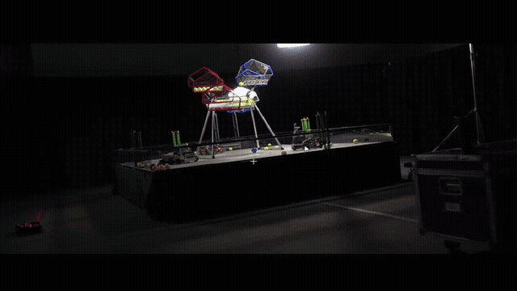

# Hive Vision — FTC ball detection

<p align="center"></p>

Hive Vision is a real-time ball-detection suite for FTC, ready to drop into
your robot stack. Every game object — the team's balls in their lane colors —
is found and tracked with two deployment options:

| Track | Where it runs | Cost | Artifacts |
|-------|---------------|------|-----------|
| **Limelight (ONNX)** | on the Limelight connected to the robot | small YOLOv8n model | [`yolo/weights/best.onnx`](yolo/README.md) (+ `.pt` source) |
| **Control Hub (OpenCV)** | on the robot Control Hub itself | none — pure OpenCV, no model | [`TeamCode/BallDetectorPipeline.java`](cv/README.md) |

These are two alternative robot deployments. Use the Limelight track when the
robot has a Limelight; use the Control Hub track when detection must run on the
Control Hub without a model or coprocessor. The Limelight model detects
`yellow`, `red`, and `blue` in that class order. The Control Hub detector
returns color candidates and must be confirmed across several frames before
the robot acts on one.

## Features

- **Two hardware paths, one tuning** — the HSV ranges in the Control Hub
  track are learned from the Limelight track's detections, so both agree on
  where the balls are.
- **No coprocessor, no model** for the hub track — just EasyOpenCV on the
  Control Hub.
- **~2 confirmable blob candidates per frame** after gating (a 900–12000 px
  ball-size band, squareness, and fill) vs ~50 raw threshold blobs.
- **Best-blob picker per color** — nearest to the real ball's area and
  roundness, penalized at the frame edge, so robot panels of the same hue
  don't win.
- **Measured, not guessed** — recall vs model ground truth on real match
  footage: yellow 69%, red 80%, blue 82% (full report in
  [`cv/docs/cv_detector_report.md`](cv/docs/cv_detector_report.md)).

## PC tools

```bash
pip install -r requirements.txt
```

Python 3.10+ is required only for the optional PC viewers, evaluation, and
tuning tools. The Limelight deployment uses the shipped ONNX file; the
Control Hub deployment uses the Java file and does not need Python.

## Quick start

### Limelight track (ONNX / YOLO)

```bash
# Real-time viewer (webcam; run from this directory)
python yolo/scripts/detect_video_realtime.py --weights yolo/weights/best.pt

# ...or over a video file
python yolo/scripts/detect_video_realtime.py --weights yolo/weights/best.pt --source path/to/match.mp4

# Export an annotated video with labels
python yolo/scripts/export_annotated.py --weights yolo/weights/best.pt --source path/to/match.mp4 --out annotated.mp4
```

### Control Hub track (OpenCV)

```bash
# Preview the on-hub detector output on your own footage (same viewer keys)
python cv/tools/realtime_cv.py --source path/to/match.mp4

# Verify the shipped config against model truth (needs the match video)
python cv/tools/eval_cv_vs_yolo.py --config cv/tools/hsv_tuned.json --source path/to/match.mp4
```

For the robot, upload `yolo/weights/best.onnx` to the Limelight model runner
and read its three class detections through the Limelight API used by your FTC
integration. For the Control Hub path, copy
`cv/TeamCode/BallDetectorPipeline.java` into `TeamCode/`, register it with a
`VisionPortal`, and read `bestOf(BallColor)` — see [cv/README.md](cv/README.md).

## Publishing the model for Limelight

`yolo/weights/best.onnx` ships pre-exported for the Limelight model runner
(YOLOv8n, input 960×960, opset 12, ~12 MB). Upload this file in the Limelight
web interface, select the model runner, and verify the input size and class
names before connecting the FTC-side result reader. To re-export with
different settings:

```bash
python -m ultralytics.export model=yolo/weights/best.pt format=onnx imgsz=960 opset=12
```

- `imgsz 960` is the quality setting used for development — tiny far-corner
  balls are recovered that 640 misses (see `yolo/README.md`).
- If your Limelight/coprocessor has an input-size limit, re-export at a
  smaller `imgsz` (e.g. `640`); expect far-corner recall to drop.
- Always re-export and re-upload after re-tuning on a new field.

## Performance

| Track | Recall | Precision | Note |
|-------|--------|-----------|------|
| Limelight (YOLOv8n, 960) | reference | reference | source of ground truth |
| Control Hub (OpenCV) | yellow 68.7% / red 80.1% / blue 82.3% | 40 / 26 / 66% | treat as a candidate signal |

## Repo layout

```
hive-vision/
  yolo/                       Limelight track
    weights/best.pt           YOLOv8n source checkpoint (6 MB)
    weights/best.onnx         exported ONNX for Limelight (12 MB)
    scripts/                  live viewer + annotated-video exporter
  cv/                         Control Hub track
    TeamCode/                 VisionPortal processor (drop-in for the FTC SDK)
    tools/                    tuning/eval tooling + shipped HSV config
    docs/                     evaluation report, cached model truth
  demo/                       short annotated example clips
  logo.png                    project logo
  LICENSE                     MIT — Copyright (c) 2026 Harjas Sidhu
```

## Demo clips

These short 1920x1080 clips show the two deployment paths on match footage.
They were sourced from the [ReVela kickoff video](https://www.youtube.com/watch?v=gO98TkgY0kI)
and are examples for visual inspection, not a replacement for field testing
or the precision/recall measurements in the CV report.

| Clip | Track |
|------|-------|
| [`demo/yolo_example_1.mp4`](demo/yolo_example_1.mp4) | Limelight/YOLO example |
| [`demo/yolo_example_2.mp4`](demo/yolo_example_2.mp4) | Limelight/YOLO example |
| [`demo/yolo_example_3.mp4`](demo/yolo_example_3.mp4) | Limelight/YOLO example |
| [`demo/control_hub_cv_example_1.mp4`](demo/control_hub_cv_example_1.mp4) | Control Hub/OpenCV example |
| [`demo/control_hub_cv_example_2.mp4`](demo/control_hub_cv_example_2.mp4) | Control Hub/OpenCV example |

### Automatic video previews

These animated previews loop automatically in GitHub. Open the MP4 links above
for the full-resolution clips with playback controls.





### Image samples

These samples use a screenshot from the same [ReVela kickoff video](https://www.youtube.com/watch?v=gO98TkgY0kI)
as input. YOLO samples show the effect of two confidence thresholds; OpenCV
samples show the normal best-candidate output and the full set of gated
candidates.

| Model | Sample 1 | Sample 2 |
|-------|----------|----------|
| Limelight/YOLO | [confidence 0.25](demo/samples/yolo_sample_1_conf25.jpg) | [confidence 0.50](demo/samples/yolo_sample_2_conf50.jpg) |
| Control Hub/OpenCV | [best candidate](demo/samples/control_hub_cv_sample_1_best.jpg) | [all gated candidates](demo/samples/control_hub_cv_sample_2_all.jpg) |

## Community

Join the [Hive Vision Discord server](https://discord.gg/m2yPTprccv) to share
robot tests, training data, detector results, and setup questions.
Project contact on Discord: `harjas_sidhu`.

## Updates and training data

Hive Vision will be updated throughout the season, with a planned release or
model update every other week as new match footage, field conditions, camera
angles, and difficult examples become available. Updates may include refreshed
YOLO weights, improved OpenCV HSV settings, new evaluation results, and new
demo samples.

To contribute training data, join the Discord server and share a link in the
training-data discussion. Include the source, camera resolution, frame rate,
lighting conditions, and permission to use the footage. Useful submissions
include clear ball views, tiny or blurred balls, partially hidden balls,
robot-panel false positives, and empty-field images.

## License

MIT — see [LICENSE](LICENSE).