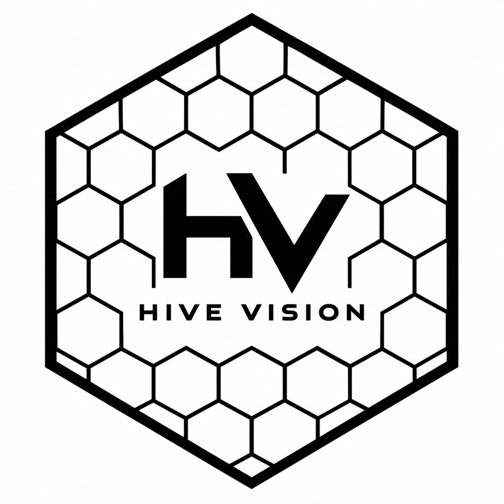
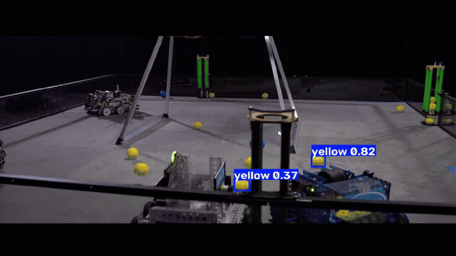
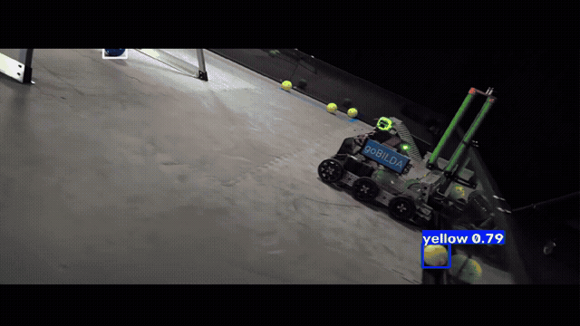
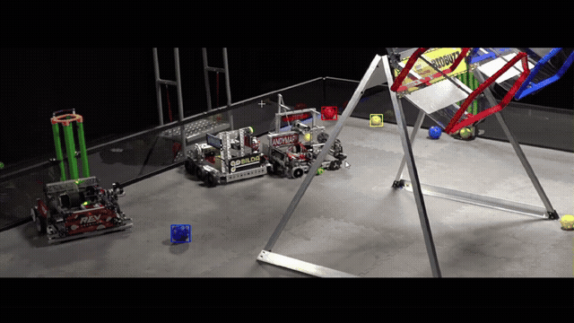
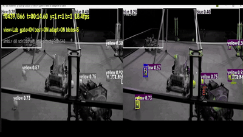

# Hive Vision — FTC ball detection

<p align="center"></p>

Full docs: <https://sidhuharjas.gitbook.io/hive-vision>

Hive Vision is a real-time ball-detection suite for FTC, ready to drop into
your robot stack. Every game object — the team's balls in their lane colors —
is found and tracked with three deployment options:

| Track | Where it runs | Cost | Artifacts |
|-------|---------------|------|-----------|
| **Limelight 3A (TFLite)** | on the Limelight 3A connected to the robot | **SSD-MobileNetV2** (300×300, uint8-in / float-out `.tflite`) — the model now in place instead of YOLO | [`neural-net/weights/best_limelight3a_ssd_mobilenetv2_300x300.tflite`](neural-net/README.md) + [`labels.txt`](neural-net/weights/labels.txt) |
| **PC / ONNX Runtime (YOLO)** | dev laptop, Jetson, or another ONNX Runtime coprocessor — **not a Limelight** (Limelight neural detectors accept `.tflite`/`.hef` only, never ONNX) | YOLOv8n reference model | [`neural-net/weights/best.onnx`](neural-net/README.md) (+ `.pt` source) |
| **Control Hub (OpenCV)** | on the robot Control Hub itself | none — pure OpenCV, no model | [`TeamCode/BallDetectorPipeline.java`](cv/README.md) |
| **Control Hub (Lab)** | on the robot Control Hub itself | one Lab conversion, no model | [`TeamCode/LabBallDetectorPipeline.java`](lab/README.md) |

These are alternative robot deployments. Use the Limelight 3A track when the
robot has a Limelight 3A; use a Control Hub track when detection must run on
the Control Hub without a model or coprocessor — pick the **Lab** track when
balls end up in shadows (it is immune to the classic HSV shadow failure), the
raw-HSV track when you want the absolute cheapest path. The Limelight 3A SSD
and the YOLOv8n ONNX model both detect `yellow`, `red`, and `blue` in that
class order. The Control Hub detectors return color candidates and must be
confirmed across several frames before the robot acts on one.

Note: no Limelight runs ONNX — Limelight neural detectors accept `.tflite` or
Hailo `.hef` only. The Limelight 3A runs **SSD-MobileNetV2 in place of YOLO**
(see `neural-net/README.md`); the YOLOv8n ONNX lives on a **PC / ONNX Runtime
host**. The Control Hub **Lab** track was tuned using this repo's *other*
YOLO — the YOLOv8n reference model — as its ground truth.

## Deployment tradeoffs

| Option | Strengths | Tradeoffs |
|--------|-----------|-----------|
| Limelight 3A (SSD-MobileNetV2) | on-robot neural detection, adaptable to shape, distance, blur, and changing backgrounds | Requires a Limelight 3A, model upload, and FTC-side result integration |
| PC / ONNX Runtime (YOLOv8n reference) | same CNN used as the reference; runs anywhere with ONNX Runtime (Jetson, dev PC) | not a robot deployment — and no Limelight can load ONNX |
| Control Hub OpenCV | Lightweight, low-cost, and fast to run locally with no model or coprocessor | Less adaptable to lighting, white balance, camera resolution, and colors that resemble the balls; requires field retuning |
| Control Hub Lab | Same cost as OpenCV, but matches on Lab chromaticity hue with an adaptive chroma floor — the classic HSV shadow failure (a shadowed ball reading as a different color) is largely gone | Slightly more compute than HSV; deep-shadow balls are so desaturated that no color-only detector can see them (then use the Limelight 3A SSD track) |

Use OpenCV when simplicity and low hardware cost matter most. Use the Lab
variant when balls live in shadows. Use the Limelight 3A track when the robot
can support it and detection reliability matters more than the extra hardware
and setup — that track runs **SSD-MobileNetV2** in place of YOLO. The YOLOv8n
ONNX export is a **PC / ONNX Runtime** artifact (dev laptop, Jetson, or other
coprocessor); it never goes on a Limelight.

## Features

- **Three paths, one tuning** — every Control Hub variant is learned from the
  repo's YOLOv8n reference detections (the Lab hue bands/floor via
  `lab/tools/fit_lab_from_yolo.py`, the HSV ranges likewise), so all three
  agree on where the balls are. The Lab detector was therefore **optimized
  with this repo's other YOLO** (the YOLOv8n reference detections), even
  though the Limelight 3A now ships SSD-MobileNetV2.
- **No coprocessor, no model** for the hub tracks — just EasyOpenCV on the
  Control Hub.
- **Shadow-proof middle track** — Lab separates lightness from chromaticity,
  so a ball in shadow keeps its hue and only needs a lower chroma bar, which
  the detector sets adaptively per frame (measured dark-frame red recall
  95.5% vs 40% for HSV on the same truth).
- **~2 confirmable blob candidates per frame** after gating (a 900–12000 px
  ball-size band, squareness, and fill) vs ~50 raw threshold blobs.
- **Best-blob picker per color** — nearest to the real ball's area and
  roundness, penalized at the frame edge, so robot panels of the same hue
  don't win.
- **Measured, not guessed** — recall vs model ground truth on real match
  footage: yellow 69%, red 80%, blue 82% (full report in
  [`cv/docs/cv_detector_report.md`](cv/docs/cv_detector_report.md)).

## Model details

Two deployed Limelight models were trained on synthetic renders plus real
footage — the SSD retrain now uses a corpus of roughly 10,000 labeled images
(the SSD training set alone is ~9,480 images, up from ~7,000):

- **YOLOv8n** (`neural-net/weights/best.pt` / `best.onnx`) — the ONNX/reference
  model, running on a PC / ONNX Runtime host (Jetson, dev laptop) rather than
  a Limelight, and the ground-truth source the Control Hub Lab and HSV tracks
  were tuned against (this repo's "other YOLO").
- **SSD-MobileNetV2** (`best_limelight3a_ssd_mobilenetv2_300x300.tflite`) —
  the model **in place instead of YOLO** on the Limelight 3A neural detector,
  retrained for the 3A's required full-INT8 `TFLite_Detection_PostProcess`
  contract (details in [`neural-net/README.md`](neural-net/README.md)). The shipped
  version (v1.1.0) was retrained with shadow-hardening data and hard negatives
  (wiring, robot chassis, field signage) so shadows and off-field objects are
  no longer reported as game elements.

The dataset includes yellow, red, and blue balls, plus difficult examples
involving blur, occlusion, distance, field lighting, shadows, and
robot-colored distractions. Evaluation results were measured on separate
footage from the training images.

## PC tools

```bash
pip install -r requirements.txt
```

Python 3.10+ is required only for the optional PC viewers, evaluation, and
tuning tools. The Limelight 3A deployment uses the shipped SSD `.tflite`; the
PC / ONNX Runtime track uses `best.onnx`; the Control Hub deployment uses the
Java files and does not need Python.

### Licensing

Original Hive Vision code, documentation, and configuration are released
under the MIT License. The YOLO weights and Ultralytics-dependent training or
inference material are distributed subject to Ultralytics' AGPL-3.0 licensing
terms; see [THIRD_PARTY_NOTICES.md](THIRD_PARTY_NOTICES.md). Check those terms
before incorporating the YOLO artifacts into a closed-source product.

## Quick start

### PC / ONNX Runtime track (YOLOv8n reference / dev tooling)

```bash
# Real-time viewer (webcam; run from this directory)
python neural-net/scripts/detect_video_realtime.py --weights neural-net/weights/best.pt

# ...or over a video file
python neural-net/scripts/detect_video_realtime.py --weights neural-net/weights/best.pt --source path/to/match.mp4

# Export an annotated video with labels
python neural-net/scripts/export_annotated.py --weights neural-net/weights/best.pt --source path/to/match.mp4 --out annotated.mp4
```

### Control Hub track (OpenCV)

```bash
# Preview the on-hub detector output on your own footage (same viewer keys)
python cv/tools/realtime_cv.py --source path/to/match.mp4

# Verify the shipped config against model truth (needs the match video)
python cv/tools/eval_cv_vs_yolo.py --config cv/tools/hsv_tuned.json --source path/to/match.mp4
```

### Control Hub track (Lab — shadow-robust chromaticity, no model)

```bash
# Preview the Lab detector on your own footage
python lab/tools/realtime_lab.py --source path/to/match.mp4

# Live-tune the hue band + adaptive chroma floor on a field frame/webcam
python lab/tools/lab_tuner.py path/to/frame.jpg

# Verify versus the same model truth (learned config in lab/tools/lab_tuned.json)
python lab/tools/eval_lab_vs_yolo.py --source path/to/match_raw.mp4 \
  --config lab/tools/lab_tuned.json --compare-hsv
```

For the Limelight 3A, upload
**`neural-net/weights/best_limelight3a_ssd_mobilenetv2_300x300.tflite`** — the
SSD-MobileNetV2 model in place instead of YOLO — with
[`neural-net/weights/labels.txt`](neural-net/weights/labels.txt) and class order
`yellow_pollen`, `red_nectar`, `blue_nectar`. No Limelight accepts ONNX; the
YOLOv8n `best.onnx` (and the float32/int8 YOLO `.tflite` test artifacts) run
on a PC / ONNX Runtime host. Read detections through the
Limelight API used by your FTC integration. For the Control Hub paths, copy
`cv/TeamCode/BallDetectorPipeline.java` (HSV) or
`lab/TeamCode/LabBallDetectorPipeline.java` (Lab chromaticity) into
`TeamCode/`, register the processor with a `VisionPortal`, and read
`bestOf(BallColor)` — see [cv/README.md](cv/README.md) and
[lab/README.md](lab/README.md).

### Limelight 3A FTC integration

Once the model is on the Limelight, [`limelight_3a_pedro_example/`](limelight_3a_pedro_example/README.md)
is the ready-to-read FTC-side code: a `BallTracker` perception core (confidence
+ staleness gating, a color-bound target lock, field projection), two drivers
using it — `BallChaseController` (no-odometry teleop/auto state machine) and
`BallChaseFollower` (Pedro Pathing auto hybrid) — and a fluent `BallWrangler`
verb API over Pedro or mecanum drivetrains. The one-liner:

```java
int picked = new BallHunt(follower, limelight, intake)
        .reds().collect(2).within(20)
        .go(this);   // blocking: drives, picks 2 red balls, hands control back
```

It compiles against FTC SDK 11.x + Pedro Pathing 2.x with a laptop self-test
(`\.compile_check.cmd -runwrapper`). Full class reference and tuning table:
[`limelight_3a_pedro_example/MODULES.md`](limelight_3a_pedro_example/MODULES.md).

## Publishing the model for Limelight

`neural-net/weights/best.onnx` ships pre-exported for **ONNX Runtime hosts** — a dev
PC, a Jetson, or another ONNX-capable coprocessor (Limelights are not
ONNX-capable; their neural detectors take `.tflite`/`.hef` only).
(YOLOv8n, input 960×960, opset 12, ~12 MB). Its output is the **raw YOLO
tensor** `output0` (1×7×18900) — anchor-row cx/cy/w/h + three class scores,
not decoded detections; do the decode + NMS on the device or in your FTC
pipeline. Upload this file in the Limelight web interface, select the model
runner, and verify the input size and class names before connecting the
FTC-side result reader. To re-export with different settings:

```bash
python -m ultralytics.export model=neural-net/weights/best.pt format=onnx imgsz=960 opset=12
```

- `imgsz 960` is the quality setting used for development — tiny far-corner
  balls are recovered that 640 misses (see `neural-net/README.md`).
- If your Limelight/coprocessor has an input-size limit, re-export at a
  smaller `imgsz` (e.g. `640`); expect far-corner recall to drop.
- Always re-export and re-upload after re-tuning on a new field.

For the **Limelight 3A** neural detector, do not upload the ONNX or the float
in/out YOLO TFLite exports — the 3A requires a full-INT8 SSD with
`TFLite_Detection_PostProcess`. Upload
`best_limelight3a_ssd_mobilenetv2_300x300.tflite` with `labels.txt`; its
outputs are the SSD post-process tensors (`num`, `scores [1,10]`,
`class_ids [1,10]`, `boxes [1,10,4]`, normalized), read them through the
Limelight API used by your FTC integration (see
[`neural-net/README.md`](neural-net/README.md)).

## Performance

| Track | Recall | Precision | Note |
|-------|--------|-----------|------|
| Limelight (YOLOv8n, 960) | reference | reference | source of ground truth; also the "other YOLO" the Lab track was tuned with |
| Control Hub (OpenCV) | yellow 68.7% / red 80.1% / blue 82.3% | 40 / 26 / 66% | treat as a candidate signal |
| Control Hub (Lab) | yellow 45.5% / red 46.0% / blue 54.5% | 8 / 9 / 8% | measured on *newer* dev footage; dark-frame red recall 95.5% vs 40% for HSV (see [lab report](lab/docs/lab_detector_report.md)) |

## Repo layout

```
hive-vision/
  neural-net/              Limelight track (SSD TFLite + YOLO ONNX)
    weights/best.pt           YOLOv8n source checkpoint (6 MB) — reference model; the Lab track's tuning truth
    weights/best.onnx         exported ONNX, ONNX Runtime only (12 MB) — Limelight neural detectors don't run ONNX
    weights/best_limelight3a_ssd_mobilenetv2_300x300.tflite  Limelight 3A model (5 MB, SSD-MobileNetV2 — in place of YOLO)
    weights/best_limelight3a_float32.tflite  float32 YOLO export (12 MB) — PC/ONNX testing only
    weights/best_limelight3a_int8.tflite     int8-weight YOLO export (3.4 MB) — PC/ONNX testing only
    weights/labels.txt        class labels: pollen/nectar order
    scripts/                  live viewer + annotated-video exporter
  cv/                         Control Hub track (HSV)
    TeamCode/                 VisionPortal processor (drop-in for the FTC SDK)
    tools/                    tuning/eval tooling + shipped HSV config
    docs/                     evaluation report, cached model truth
  lab/                        Control Hub track (Lab chromaticity)
    TeamCode/                 LabBallDetectorPipeline.java (drop-in processor)
    tools/                    YOLO-learned config, fitter, sweep, tuner, viewer
    docs/                     evaluation report, cached YOLO truth
  limelight_3a_pedro_example/ FTC-side integration (BallTracker + chase drivers)
    final/                    ship-ready: BallTracker, BallChaseController/Follower, BallHunt
    wrapper/                  fluent verb API over Pedro/mecanum drivetrains
    MODULES.md                class reference; README.md = usage + calibration
  shipping/                   ready-to-ship handbook (artifacts, comparison, checklist)
  demo/                       short annotated example clips
  logo.png                    project logo
  LICENSE                     MIT (code) — see THIRD_PARTY_NOTICES.md for neural-net/ (AGPL-3.0)
```

## Shipping

Ready to deploy? Start at
[`shipping/SHIP_README.md`](shipping/SHIP_README.md) — one checklist and one
place listing every artifact, where it goes, the three-track comparison, the
int8 rationale, and the two remaining hardware-validation steps.

## Demo clips

These short 1920x1080 clips show the deployment paths on real footage.
They were sourced from the [kickoff video](https://www.youtube.com/watch?v=gO98TkgY0kI)
and are examples for visual inspection, not a replacement for field testing
or the precision/recall measurements in the CV report.
Confirm that you have permission to redistribute any source footage before
publishing these demo files outside this repository. Replace them with your
own footage if permission is unclear.

`demo/ssd_in_action.mp4` was filmed by **Javi Nashat** (Lazer Robotics 23286)
and shows the Limelight 3A SSD detector tested in the real world. Contact/handles:
Discord `@Destroyer` (handle `destroyer5782`).

| Clip | Track |
|------|-------|
| [`demo/yolo_example_1.mp4`](demo/yolo_example_1.mp4) | YOLO example |
| [`demo/yolo_example_2.mp4`](demo/yolo_example_2.mp4) | YOLO example |
| [`demo/ssd_mobilenetv2.mp4`](demo/ssd_mobilenetv2.mp4) | Limelight 3A SSD-MobileNetV2 example |
| [`demo/control_hub_cv_example_1.mp4`](demo/control_hub_cv_example_1.mp4) | Control Hub/OpenCV example |
| [`demo/control_hub_cv_example_2.mp4`](demo/control_hub_cv_example_2.mp4) | Control Hub/OpenCV example |
| [`demo/cielab_demo.mp4`](demo/cielab_demo.mp4) | CIELAB (Lab track) example — own match capture |
| [`demo/ssd_in_action.mp4`](demo/ssd_in_action.mp4) | Limelight 3A SSD-MobileNetV2 tested in the real world — recorded by Javi Nashat, Lazer Robotics 23286 |

### Automatic video previews

These animated previews loop automatically in GitHub. Open the MP4 links above
for the full-resolution clips with playback controls.











### Image samples

These samples use a screenshot from the same [kickoff video](https://www.youtube.com/watch?v=gO98TkgY0kI)
as input. YOLO samples show the effect of two confidence thresholds; OpenCV
samples show the normal best-candidate output and the full set of gated
candidates.

| Model | Sample 1 | Sample 2 |
|-------|----------|----------|
| Limelight/YOLO | [confidence 0.25](demo/samples/yolo_sample_1_conf25.jpg) | [confidence 0.50](demo/samples/yolo_sample_2_conf50.jpg) |
| Control Hub/OpenCV | [best candidate](demo/samples/control_hub_cv_sample_1_best.jpg) | [all gated candidates](demo/samples/control_hub_cv_sample_2_all.jpg) |

## Community

Join the [Hive Vision Discord server](https://discord.gg/m2yPTprccv) to share
robot tests, training data, detector results, and setup questions. You can also
[open an issue on GitHub](https://github.com/sidhuharjas/Hive-Vison/issues)
for bugs, suggestions, or dataset contributions.

## Updates and training data

Hive Vision will be updated throughout the season, with a planned release or
model update every other week as new real footage, field conditions, camera
angles, and difficult examples become available. Updates may include refreshed
YOLO or SSD-MobileNetV2 weights, improved OpenCV HSV settings, new evaluation
results, and new demo samples.

To contribute training data, join the Discord server and share a link in the
training-data discussion. Include the source, camera resolution, frame rate,
lighting conditions, and permission to use the footage. Useful submissions
include:

- Real robot footage with no balls in view, so the model learns backgrounds,
  robot parts, field markings, and empty-field negatives.
- A 360-degree view of the field from the camera position, when possible.
- Many ball views at different distances, angles, lighting conditions, and
  levels of motion blur.
- Tiny, partially hidden, overlapping, or edge-of-frame balls.
- Robot panels, tape, shadows, reflections, and other false-positive examples.

## Training-data workflow

1. Share the original video or image link in Discord or a GitHub issue.
2. Include the camera, resolution, frame rate, lighting, field location, and
  permission to use the footage.
3. Separate useful empty-field footage from clips containing visible balls.
4. Label visible balls as `yellow`, `red`, or `blue`; do not label objects that
  only resemble balls.
5. Keep a note describing difficult cases and what the current model missed.
6. After review, accepted data can be included in a future every-other-week
  dataset or model update.

Contributors whose training data or testing work is accepted may request a
certificate recognizing their contribution to Hive Vision. The certificate
can describe work such as real-robot data collection, labeling, hard-negative
mining, evaluation, or detector testing, and may be included in a portfolio or
resume. Requests can be made through a GitHub issue or the Discord server.
Recognition will describe the specific contribution and will not imply
authorship of the entire project.

## License

Original Hive Vision code, documentation, and configuration are MIT — see
[LICENSE](LICENSE). YOLO model artifacts and Ultralytics-dependent material
are AGPL-3.0 — see [THIRD_PARTY_NOTICES.md](THIRD_PARTY_NOTICES.md).