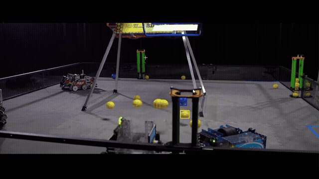

# Overview

Hive Vision is a real-time FTC ball-detection suite (`yellow_pollen`, `red_nectar`, `blue_nectar`). The repo README is the source of truth for everything technical; this book exists to (a) help a new team pick a track and (b) give step-by-step setup instructions you can follow with the camera on the bench.

* [Which detector track?](detector_tracks/) — the decision guide
* [Limelight 3A (SSD)](detector_tracks/limelight_3a_setup.md) — set it up step by step
* [PC / ONNX Runtime (YOLO)](detector_tracks/onnx_pc.md)
* [Control Hub (OpenCV + Lab)](detector_tracks/control_hub.md)
* [Deployment checklist](deployment_checklist.md) — what ships where

Classes are always `yellow_pollen`=0, `red_nectar`=1, `blue_nectar`=2.

## In action

Same kickoff footage through each detector:

The Limelight 3A model in the real world:

