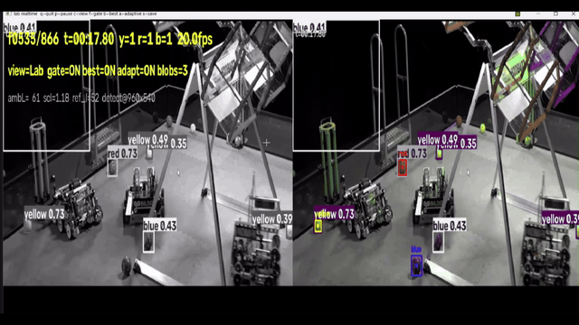

# Which detector track?

Measured precision/recall for every track lives in [the repo README](https://github.com/sidhuharjas/Hive-Vision/blob/main/README.md) and the [cv report](https://github.com/sidhuharjas/Hive-Vision/blob/main/cv/docs/cv_detector_report.md) / [lab report](https://github.com/sidhuharjas/Hive-Vision/blob/main/lab/docs/lab_detector_report.md). This page is only the decision logic.

## The tracks

* [Limelight 3A (SSD)](limelight_3a_ssd/) — the on-robot neural track
* [PC / ONNX Runtime (YOLO)](onnx_pc/) — the reference model + dev tooling
* [Control Hub (OpenCV + Lab)](control_hub/) — model-free color tracks

## Rules of thumb

* Use the **Limelight 3A** when the robot can carry one and reliability matters more than the extra hardware — it's the only track that understands _shape_.
* Use the **Lab track** when balls end up in shadows; it's the only color detector that survives shadow (dark-frame red recall \~95% vs \~40% for HSV).
* Use the **HSV track** for the absolute cheapest path with stable field lighting.
* Never trust a color-only track (HSV or Lab) in the darkest corners — treat hub outputs as candidates to confirm across frames, not detections.
* No Limelight runs ONNX — the 3A track ships SSD-MobileNetV2 in place of YOLO.

## See each track run

Same kickoff footage, one preview per detector:

Still-frame samples: [YOLO @ 0.25](../demo/samples/yolo_sample_1_conf25.jpg) · [YOLO @ 0.50](../demo/samples/yolo_sample_2_conf50.jpg) · [CV best candidate](../demo/samples/control_hub_cv_sample_1_best.jpg) · [CV all gated candidates](../demo/samples/control_hub_cv_sample_2_all.jpg)
