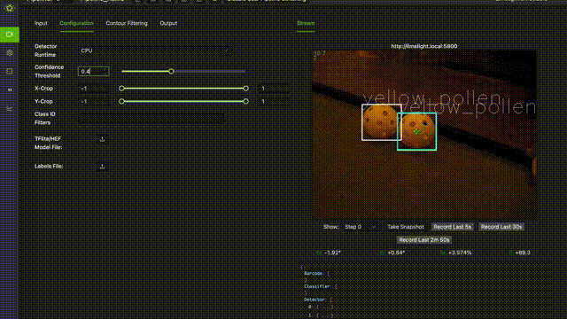

# Hive Vision — ready-to-ship handbook

Everything needed to deploy the full three-track stack, gathered in one place.
Work through the checklist, then hand the artifacts to whoever flashes the
robot.

## In action

The shipped SSD-MobileNetV2 Limelight 3A model, tested in the real world
(footage by Javi Nashat, Lazer Robotics 23286):



## What ships where

| Destination | Artifact | Path |
|-------------|----------|------|
| Limelight 3A | SSD-MobileNetV2 300×300 (uint8-in, float out) | `../neural-net/weights/best_limelight3a_ssd_mobilenetv2_300x300.tflite` |
| Limelight 3A | class labels | `../neural-net/weights/labels.txt` |
| PC / ONNX Runtime (Jetson, dev PC) | YOLOv8n ONNX, 960×960 (no Limelight runs ONNX) | `../neural-net/weights/best.onnx` |
| PC only | YOLO float32 TFLite test artifact | `../neural-net/weights/best_limelight3a_float32.tflite` |
| PC only | YOLO int8-weight (DRQ) TFLite test artifact, 3.4 MB | `../neural-net/weights/best_limelight3a_int8.tflite` |
| Control Hub | HSV Java pipeline | `../cv/TeamCode/BallDetectorPipeline.java` |
| Control Hub | Lab chromaticity Java pipeline | `../lab/TeamCode/LabBallDetectorPipeline.java` |
| Control Hub | Lab learned config | `../lab/tools/lab_tuned.json` |
| — | source checkpoint (re-training/re-export) | `../neural-net/weights/best.pt` |

Class order is `yellow_pollen`, `red_nectar`, `blue_nectar` — keep
`labels.txt` matching on the 3A. The SSD-MobileNetV2 3A model emits
**`TFLite_Detection_PostProcess`** outputs (`num`, `scores`, `class_ids`,
`boxes`) already decoded — no NMS needed on your side. The ONNX and the YOLO
float32/int8 TFLite exports instead emit the **raw YOLO tensor** `output0`
(1×7×18900) — [cx, cy, w, h, scores ×3] in the model grid, pre-NMS — and the
device or FTC pipeline must decode and NMS those itself.

## The three tracks, compared

Measured against a 293-frame real-match dataset that the flagship YOLO scored
at conf ≥ 0.35 (identical ground truth for both color detectors; all three
share the same geometry gates):

| Tracker | Runs on | Principle | Yellow rec/prec | Red rec/prec | Blue rec/prec | Dark-red recall |
|---------|---------|-----------|-----------------|--------------|---------------|-----------------|
| **YOLO** | PC / ONNX Runtime (reference — not a Limelight) | shape + context (CNN) | — ground truth — | — ground truth — | — ground truth — | ~100% |
| **HSV (cv/)** | Control Hub | tuned HSV window | 62.0 / 10.5 | 34.5 / 8.6 | 52.8 / 11.1 | 40.0% |
| **Lab (lab/)** | Control Hub | learned Lab hue band + adaptive chroma floor | 45.5 / 7.5 | 46.0 / 8.7 | 54.5 / 8.1 | **95.5%** |

What the numbers mean:

- **YOLO is the reference.** It is the only track that finds shapes, so it is
  the only one that recovers low-chroma / deep-shadow balls. Treat its output
  as truth and the Control Hub tracks as candidate signals (7–11% precision on
  this footage — the field is full of yellow/red/blue patches).
- **Lab beats HSV on red** in recall and precision, and crushes it in shadows
  (95.5% vs 40% dark-frame recall). That is its purpose: Lab hue is
  shadow-invariant and its chroma floor adapts downward per frame.
- **HSV keeps yellow and blue precision.** Its yellow window was hand-tuned on
  luckier footage; Lab is rigidly fit on this one.
- Pick a track per robot, not per color: Lab when balls sit in shadows,
  HSV when you want the absolute cheapest path. Never rely on a color detector
  in the darkest corners — that is YOLO's job.

Full detail: [`../lab/docs/lab_detector_report.md`](../lab/docs/lab_detector_report.md)
and [`../cv/docs/cv_detector_report.md`](../cv/docs/cv_detector_report.md).

## Why the int8 model is dynamic-range, not full-int8

Full-INT8 activations are impossible for this architecture: the Detect head's
per-stride branches keep separate quantization scales, which TFLite forbids on
the `CONCAT`, and a single mixed box+score tensor collapses the score rows to
zero under the box-dominated scale. The shipped `_int8` model is therefore
**int8 weights + float activations** — float32 in/out, detections within 0.02%
box delta of the float32 model, 3.4 MB vs 11.75 MB. The Limelight 3A runs
neural networks on CPU only (no Hexagon/DSP), so full-INT8 would not change on-
device performance anyway. Do not re-upload the self-converted full-INT8 file —
it outputs zero detections.

## Verified

- [x] int8 vs float32 behavior: 13-frame sweep, worst box delta 0.02%, scores
      intact, detections match
- [x] Lab dark-frame red recall 95.5% vs HSV 40.0% (same truth, same gates)
- [x] Java pipelines compile against the FTC SDK (`bestOf(BallColor)`)
- [x] Config + report + README numbers in sync
- [ ] **Upload the SSD tflite → 3A once on hardware, confirm the pipeline loads
      and reports detections** (PC runner verifies the model, not the device)
- [ ] **Run at confidence 0.35–0.45 on the 3A** — 0.25 produces visible false
      positives (identical on float32; it is a threshold property, not a
      quantization defect)

## Commands used to build these artifacts

```bash
# re-export ONNX from source
python -m ultralytics.export model=../neural-net/weights/best.pt format=onnx imgsz=960 opset=12

# rebuild the int8-weight TFLite (from the onnx2tf SavedModel; see script header)
.venv-tflite/Scripts/python.exe ../neural-net/scripts/export_int8_tflite.py

# re-verify int8 vs float32 on real frames
.venv-tflite/Scripts/python.exe ~/Temp/opencode/verify_int8.py

# re-run the Lab metrics (raw, un-annotated footage)
python ../lab/tools/eval_lab_vs_yolo.py --source path/to/match_raw.mp4 \
  --config ../lab/tools/lab_tuned.json --compare-hsv \
  --truth-json ../lab/docs/yolo_truth_lab.json
```