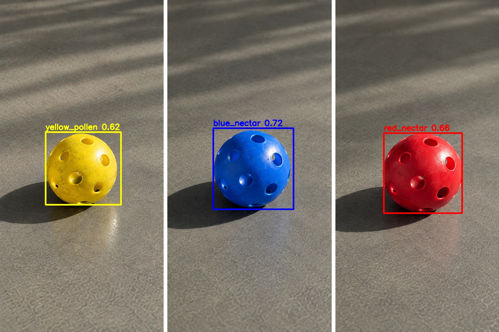

# Hive Vision v1.1.0

Retrained Limelight 3A SSD-MobileNetV2 detector with a significantly larger
and harder dataset, fixing two classes of false positives found in the field.

## What's fixed

- **Shadows are no longer detected as game elements.** Shadow-hardening data
  (shadowed and darkened balls, deep-shadow field footage) was added to the
  training set; shadowed regions are no longer reported as Pollen/Nectar.
- **Outside / off-field objects are no longer detected as balls.** Hard
  negatives covering wiring/cables, robot chassis, and field signage were
  added; scenes built to trigger these false positives now return zero
  detections.

## Model changes

- **Retrained SSD** (`yolo/weights/best_limelight3a_ssd_mobilenetv2_300x300.tflite`)
  now ships as the default Limelight 3A detector.
- Training dataset grew to **~10,000 labeled images** (9,480 train images
  across synthetic renders, real footage, and hard-negative frames), up from
  ~7,000.
- Training run: 20k steps on the Limelight online trainer, final training loss
  0.019, validation loss 0.040 (down from ~0.20 on the previous local run).
- Class order unchanged: `yellow_pollen`, `red_nectar`, `blue_nectar`
  (`yolo/weights/labels.txt`).

## Fix in action

SDD v1.1.0 on the Fixed Up field scene — all three game elements detected,
nothing else flagged:

## Credit

The shadow and outside-object false positives addressed in this release were
reported by **Team 16765 ProBotiX** (probotixbladel@gmail.com) from their
arena and robot testing — thank you for the field reports.

## Tooling

- `detect_video_ssd_realtime.py` now runs the SSD alone — the YOLO/CV ground
  truth and lab overlay were removed, so the viewer reflects exactly what the
  Limelight 3A reports on robot.

## Included

- `yolo/weights/best_limelight3a_ssd_mobilenetv2_300x300.tflite` (SSD v2,
  uint8-in / float-out, 5.0 MB) + `labels.txt`
- `yolo/weights/best_limelight3a_float32.tflite` for PC verification
- `yolo/weights/best.onnx` / `best.pt` PC YOLO reference
- Annotated MP4 demos and looping GIF previews